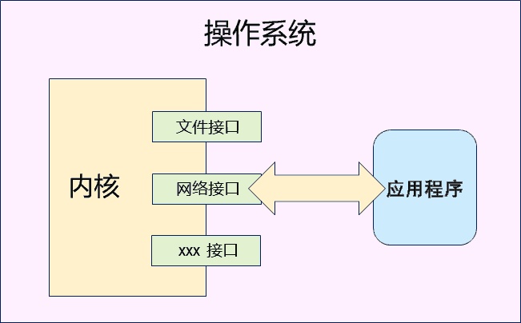
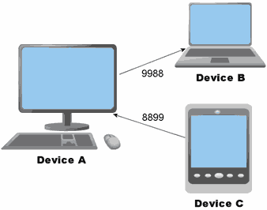
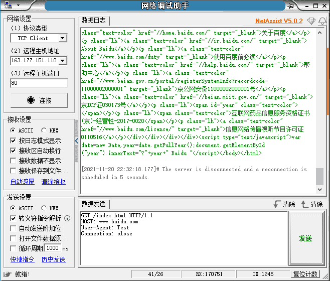
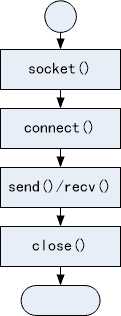

# 1. 网络编程的本质
- 使用操作系统提供的<font color=red>接口函数</font>，使得应用程序具备<font color=red>收发网络数据</font>的能力。

> 内核主要是用来管理硬件的，其中一个硬件是网卡，应用程序只能通过内核的网络接口去使用网卡

- 网络接口在代码层面是操作系统提供的函数
    - 网络编程只是一系列<font color=red>系统函数的花式玩法</font>
- 应用程序通过网络接口使用操作系统的联网能力
    - 网络编程是<font color=red>特定领域（网络）的C语言程序设计</font>

- 网络编程核心概念
    - 协议：<font color=red>为进行数据通信而预定义的数据规则</font>
    - 地址：网络通信中的用于标识设备的<font color=red>整数值</font>
        > 分段解释为一个字符串，例：192.128.1.1
    - 端口号：
        - 设备为收发数据而指定的数值，用于标识具体连接
        - 可理解为：<font color=red>设备中用于网络通信的数据通道</font>
    - 角色
        - 服务端：等待连接的设备
        - 客户端：发起连接的设备
        
        > 应用程序（客户端）联网过程是，运行后，主动连接服务端，拉起数据
        > `9988` `8899` -> 连接的编号：端口号
        > 设备A有些应用程序会连接到设备B，设备C有些应用程序会连接到设备A
        > 设备B是服务端；设备A既是服务端（等待连接），也是客户端（发起连接）；设备C时客户端

# 2. 编程实验 网络连接实验
## 2.1. 实验一
> 打开浏览器输入网址`www.baidu.com`，可浏览网页，实际上浏览器是个客户端程序。

```
C:\Users\Administrator>ping www.baidu.com

正在 Ping www.a.shifen.com [163.177.151.110] 具有 32 字节的数据:
来自 163.177.151.110 的回复: 字节=32 时间=9ms TTL=56
来自 163.177.151.110 的回复: 字节=32 时间=7ms TTL=56
来自 163.177.151.110 的回复: 字节=32 时间=8ms TTL=56
来自 163.177.151.110 的回复: 字节=32 时间=8ms TTL=56

163.177.151.110 的 Ping 统计信息:
    数据包: 已发送 = 4，已接收 = 4，丢失 = 0 (0% 丢失)，
往返行程的估计时间(以毫秒为单位):
    最短 = 7ms，最长 = 9ms，平均 = 8ms
```
> 打印以上信息，说明能连上对应的服务端。ping 是客户端应用程序，让其尝试连接对应的服务端
> 上面的网络地址`163.177.151.110`，是网址吗？下面对其做实验

## 2.2. 实验二
使用工具实验目录：[NetAssist.exe](vx_attachments\01\NetAssist\NetAssist.exe)
如下配置

> 连接上服务器后，发送下面指令，获取到网页的html代码

```
GET /index.html HTTP/1.1
HOST: www.baidu.com
User-Agent: Test
Connection: close
(换行)
(换行)
```
> 需要两个换行。若无两个换行，则接收不到服务端的数据，因未遵守协议。
> 输入的这些数据的含义先不用细究。

# 3. 网络相关的其他知识
- 网络知识充电站
    - <font color=red>网址就是IP地址吗？URL是什么，域名又是什么？</font>
        - 网址<font color=red>不是</font>IP地址，<font color=red>是</font>网络信息资源的地址（如：具体网页的地址），即：URL（Uniform Resource Locator），网络资源的唯一地址，通过一个URL，就能够找到一个具体的网络资源，比如一个MP3文件、网页。
            > 网址：`http://xxx`
        - 域名是IP（Internet Protocol）地址（网络设备的地址）的别名，因此，多个域名可指向同一个IP地址
            > <font color=red>域名</font>到IP地址的转换（通过DNS服务器转换）：域名 -> DNS（主要做查询操作） -> IP地址
    - <font color=red>协议一定是看不懂的二进制数据吗？</font>（不一定）
        - <font color=red>协议是一种约定</font>，即：预先定义的规则
        - 协议可以基于文本定义，也可以基于二进制定义

    - 小端系统
        - 采用小端模式（little-endian）的系统，即：数据低字节放在内存低地址中
            > `0x12345678`存放方法：`低地址 |78|56|34|12| 高地址`
    - 大端系统
        - 采用大端模式（big-endian）的系统，即：数据低字节放在内存高地址中
            > `0x12345678`存放方法：`低地址 |12|34|56|78| 高地址`
    - 网络字节序
        - 网络字节顺序采用<font color=red>大端</font>模式，所以：<font color=red>在小端系统中需要做字节序转换</font>

- 问题
    如何写代码复现这个网络连接实验？

- 网络编程模式
    1. 准备网络连接
    2. 连接远程设备
    3. 收发数据
    4. 关闭连接

    

- 初探网络编程接口
```c
#include <sys/types.h>
#include <sys/socket.h>
```

|                                 函教原型                                 |          功能描述          |
| ----------------------------------------------------------------------- | ------------------------- |
| int **socket**(int `domain`, int `type`, int `protocal`);               | 创建套接字，为网络连接做准备 |
| int **connect**(int `sock`, struct sockadar `*addr`, socklen_t `len`);  | 连接指定地址(IP)的远程设备   |
| ssize_t **send**(int `fd`, const void `*buf`, size_t `n`, int `flags`); | 发送数据到远程设备          |
| ssize_t **recv**(int `fd`, void `*buf`, size_t `n`, int `flags`)        | 接收远程设备发回的数据       |
| int **close**(int `fd`)                                                 | 关闭连接，销毁套接字         |

- 网络编程示例

```c
sock = socket(PF_INET, SOCK STREAM, 9); /* 为网络连接做准备，后面讲解参数意义 */
if (sock == -1) {
    printf ("sockect error\n");
    return -1;
}

/* 指定地址和端口 */
addr.sin_family = AF_INET;
addr.sin_addr.s_addr = inet addr("163.177.151.110");
addr.sin port = htons(80);

if (connect(sock, (struct sockaddr*)&addr, sizeof(addr)) == -1) {
    printf("connect error\n");
    return -1;
}

len = send(sock, tosend, strlen(tosend), 0); /* 后面讲解，最后一个参数0的意义 */
printf("send bytes =%d\n", len); /* 返回成功发送数据的长度 */
len = recv(sock, buf, sizeof(buf), 0);
printf("receive bytes =%d\n", len); /* 返回成功接收数据的长度 */

close(sock);
```

## 3.1. 编程实验 网络编程初体验
实验目录：[code](vx_attachments\01\code)
编译运行：./a.out > [output.txt](vx_attachments\01\code\output.txt)
得到上面一个实验同样的效果。

- 思考
这次课所编写的网络程序是什么角色？（客户端）
