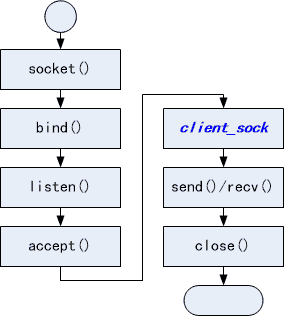
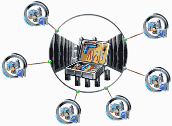
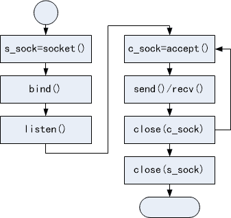
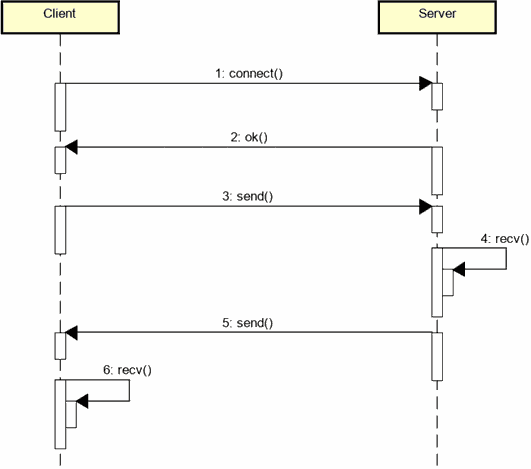

# 1. 服务端编程初体验

- 客户端/服务端编程模式（C/S模型）
    - <font color=red>服务端长期暴露于网络</font>（公开自己的IP地址），并等待客户端连接
        > 可能受网络攻击：通过恶意的客户端去连接服务端。解决：多准备几个服务端
    - <font color=red>客户端发起连接动作</font>，并等待服务端回应
    - 特点：
        - 服务端无法主动连接客户端
        - 客户端只能按照预定义的方式（协议）连接服务端

- 服务端编程模式
    1. 准备网络连接
    2. 绑定端口
    3. 进入端口监听状态
    4. 等待连接

    
    > `accept()` 拿到客户端的连接，其返回值就是与客户端真正通信的socket（`client_sock`）。

- 服务端核心工作：<font color=red>绑定</font> & <font color=red>监听</font> & <font color=red>接收</font>
    - 绑定
        ```c
        int bind(int sock, struct sockaddr *addr, socklen_t addrlen);
        ```
        > 功能：将服务端的一个socket绑定到一个地址（addr）上。
        > `addr`：包含IP地址和端口号。
        > 端口号具体用来接收连接。
    - 监听
        ```c
        int listen(int sock, int backlog);
        ```
        > `backlog`：队列长度。若有多个客户端想要连接服务端，那么这些客户端的连接需要排队。
    - 接收
        ```c
        int accept(int sock, struct sockaddr *addr, socklen_t *addrlen);
        ```
        > 返回值：与客户端通信的socket
        > 可发现服务端与客户端的socket玩法有些不一样？

- 深度剖析服务端
    - <font color=red>服务端 socket 只用于接收连接，不进行实际通信</font>
    - 当接收到连接时，`accept()`函数返回与客户端通信的socket
    - 服务端 socket 产生用于通信的客户端 socket
    - 所以，<font color=red>socket 究竟是什么玩意？</font>如何理解？
    > 目前 socket 起码分两类：1. 实际通信的 socket; 2. 接收连接的 socket。

- 深入理解`socket()`函数
    > socket 英文翻译：插线板。下面多功能插线板，作用是提供电源，多功能体现在支持三插、两插、usb供电设备。
    > 类比到网络编程的socket，也可以用同样的方式来理解。我们使用socket，不仅可用来进行<font color=red>互联网的通信</font>，还可进行<font color=red>专用网络通信</font>，及<font color=red>本地的进程间通信</font>。socket本质功能是提供通信的能力，我们可以指定什么方面的通信，类似多功能插线板。
    > 
    - `socket()`是什么？
        - `socket()`是一个"多功能"函数
    - `socket()`返回的又是什么？
        - `socket()`的返回值是用于通信的资源标识符
        > 如果我们要进行通信，就会占用操作系统的资源。因此我们需对占用的资源做一个标识。
        > 因此，在进行网络通信之前，我们要调用socket函数来作准备（申请通信时要使用的资源）。
        > 对应的资源释放，使用`close()`函数
    - `socket()`还能做什么？
        - `socket()`可提供不同类型的通信功能（本地进程间通信）


- 服务端编程示例

    ```c
    server = socket(PF_INET, SOCK_STREAM, 0); /* 作准备:为服务端申请系统资源 */
    if (server == -1) {
        printf("server socket error\n");
        return -1;
    }

    /* 设置地址：IP和端口 */
    saddr.sin_family = AF_INET;
    /* INADDR_ANY标识0.0.0.0，代表本机的连接全部接受 */
    /* 针对服务端所在主机有多个网卡的情况，每个网卡对应独立的IP地址，每个IP都可以用来通信 */
    /* 主机的IP地址是被网卡所拥有，每个网卡的能力是网络数据的收发 */
    saddr.sin_addr.s_addr = htonl(INADDR_ANY);
    saddr.sin_port = htons(8899); /* 服务端监听的端口 */

    if (bind(server, (struct sockaddr*)&saddr, sizeof(saddr)) == -1) {
        printf("server bind error\n");
        return-1:
    }
    if (listen(server, 1) == -1) { /* 1:服务端每次只服务一个客户端 */
        printf("server listen error\n");
        return -1;
    }
    printf("server start success\n");
    asize = sizeof(caddr);
    client = accept(server, (struct sockaddr*)&caddr, &asize); /* accept调用后将进入阻塞状态 */
    if (client == -1) {
        printf("client accept error\n");
        return -1;
    }
    /* 通过返回的client去send和receive */
    ```

# 2. 编程实验 服务端编程初体验
实验目录：[first-server.c](vx_attachments\02\code\first-server.c)
工具：[NetAssist.exe](vx_attachments\01\NetAssist\NetAssist.exe)
实验方法：使用网络调试工具充当客户端，给服务器发送数据，能返回正确数据。

# 3. 创建echo客户端
- 客户端/服务端 编程的核心模式
    > C/S模型：服务端长时间运行，客户端主动连接（服务端不能主动连接客户端）
    - 服务端长时间运行（死循环）接收客户端请求
    - 客户端连接后向服务端发送请求（协议数据）

    

- 服务端核心编程模式


- 客户端/服务端编程的核心模式（交互流程）


- 客户端/服务端编程实验（实验要求）
    1. 服务端持续（死循环）监听客户端连接
    2. 服务端被连接后 echo（响应） 客户端数据
    3. 服务端接收到 quit 后断开连接
    4. 客户端接收用户输入并发送到服务端

# 4. 编程实验 客户端/服务端编程实验
实验目录：[server.c](vx_attachments\02\code\server.c)、[client.c](vx_attachments\02\code\client.c)
工具：[NetAssist.exe](vx_attachments\01\NetAssist\NetAssist.exe)
实验方法：使用网络调试工具充当客户端，给服务器发送数据，能返回正确数据。
自测：ctrl+c退出服务器会有bug，没有`close(server);`，下次启动服务器会`server bind error`。

- 思考
    如何增强服务端能力，同时支持多个客户端？（客户端使用链表？select?）
