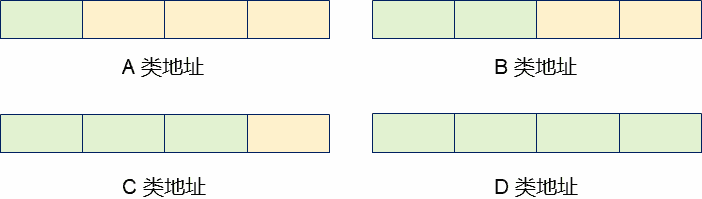
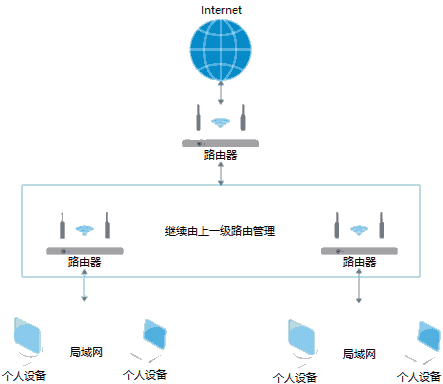
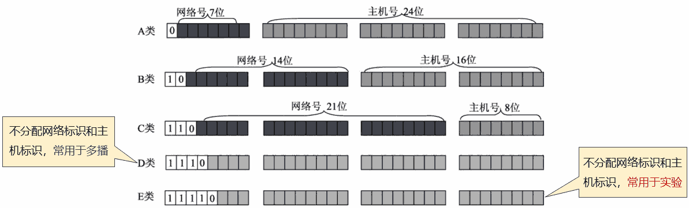
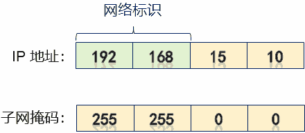
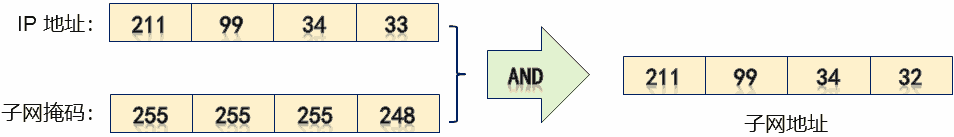
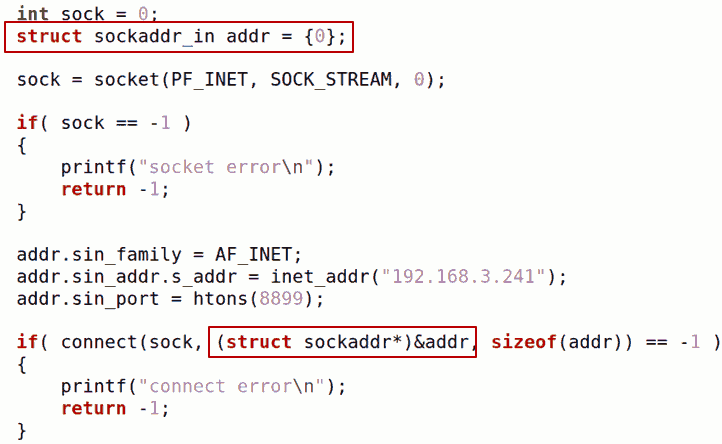
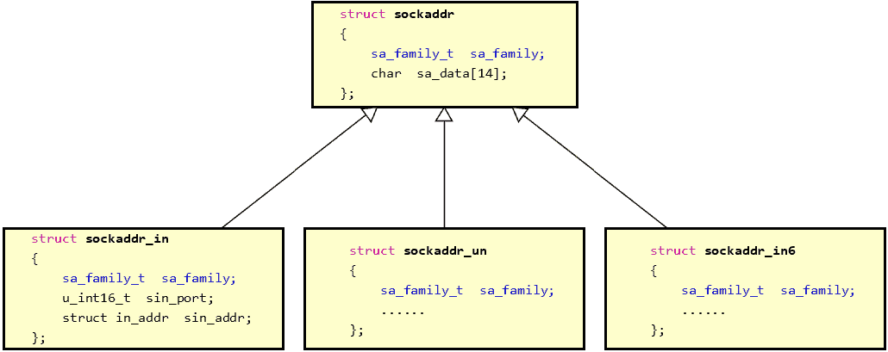

# 1. 协议
- 问题
    网络编程接口中一些参数的意义是什么？
    sock = socket(<font color=red>PF_INET</font>, <font color=red>SOCK_STREAM</font>, 0);
    > 多功能插线板中的多，就是通过这三个参数决定的

- `socket` 参数详解
```c
int socket(int domain, int type, int protocol);
```
|   参数    |                     意义                      |              例              |
| -------- | -------------------------------------------- | ---------------------------- |
| domain   | 套接字中使用的协议族信息                        | PF_INET: 基于IPV4的互联网通信 |
| type     | 套接字数据传输类型信息（协议族中的协议类型）      | -                            |
| protocol | 设备间通信使用的协议信息 （类型中具体的哪种协议） | -                            |

- `socket()`中的`domain`参数（协议族）
    - **PF_INET** → **IPv4**互联网协议族
    - `PF_INET6` → `IPv6`互联网协议族
        > 对编程而言，与IPv4的差别禁止socket()函数的参数类型不同
    - `PF_LOCAL` → 本地通信的协议族
        > 本地的进程间通信
    - `PF_PACKET` → 底层数据收发协议族
    - `PF_IPX` → `Novell`专用协议（互联网分组交换协议）
        > 专用网络通信
    - 。。。。。。
    > 注意：不同协议中的<font color=red>地址</font>表现形式可能不同，网络编程时地址类型必须和协议类型匹配。
    > IPV4地址表现形式："192.168.1.1"，看到的是字符串形式，实质是4字节整型。
    > IPV6地址表现形式："fe80::297e:2383:7935:6acf%20"。

- `socket()`中的 `type` 和 `protocol` 参数
    - type：用于指定协议类型
        - `SOCK_STREAM`：流式数据（<font color=red>TCP</font>）
        - `SOCK_UGRAM`：报文式数据（<font color=red>UDP</font>）
    - protocol：用于指定协议族中符合类型的具体协议
        - <font color=red>domain和type几乎可以唯一确定一种协议</font>，因此，这个参数通常为0
        - 参数填0的另一种理解方式，即：0代表domain和type指定后的默认协议

# 2. 传数据
- 关于`端口号`和`IP`地址
    - 端口号是一个2字节数据(无符号整数)
    - 0 - 1023作为特定端口被预定义（分配给特定应用程序）
        > 在一些特定的系统中，1024 - 2048这些较小的端口号也被预留了。
        > 若使用，可能绑定（`bind()`）不成功（返回-1）。
    - IP地址是一个4字节地址族（可分为5类地址）

    
    > 左边的字节有特殊用途

- 深入解析IP地址
    - IP地址分为<font color=red>网络标识</font>和<font color=red>主机标识</font>两部分
        - 网络标识：标识网络主机（设备）所在的网络
        - 主机标识：标识网络主机（设备）的具体地址

    
    > 问题：一个IP地址就4个字节，那么如何区分网络标识和主机标识呢？
    
    > 网络号（网络地址），主机号（主机地址）
    > A,B,C三类是我们常见的地址，D类地址用于多播（后面讲解多播）。E类地址用于多做实验。
    > 从上图可看出：常见的A、B、C类地址，网络标识的位数都是比较固定的。

- 深入解析IP地址
    - `IP地址`和`子网掩码`配合使用区分`网络标识`和`主机标识`
    - 子网掩码的表现形式也是一个4字节的整型数
    - 子网掩码用于从IP地址中提取网络标识（具体操作是按位与）

    
    > 做与运算，得到网络地址是：`192.168.0.0`

    - 深入理解子网掩码
        - 设：子网掩码为`M.N.P.Q`，则子网可用IP地址 `n = (256 - M) * (256 - N) * (256 - P) * (256-Q)`
        - 例：IP地址 211.99.34.33，掩码 255.255.255.248。因此：211.99.34.33 所在子网有8个IP地址（有2个分别是子网地址和广播地址），且 211.99.34.33 所在子网地址为 211.99.34.<font color=red>32</font>，广播地址为211.99.34.<font color=red>39</font>

        
        > 第一个可用的IP地址是211.99.34.33，最后一个可用的IP地址是211.99.34.38

    - IP地址`211.99.34.33`，掩码`255.255.255.248`
        - 可知`211.99.34.33`所在子网有8个IP地址，且8=2^<font color=red>3</font>，所以 Y = 32 - <font color=red>3</font> = 29（子网掩码的简洁表示，实际上是子网掩码中高位部分1的个数）
        - 表示为`211.99.34.33/29`（简洁表示法）
    - 算一算
        - IP地址`192.168.3.44`，掩码`255.255.255.0`，问：子网地址是什么？广播地址是什么？可用地址有多少？简洁表示法是什么？
        > 子网地址（相与）：192.168.3.0
        > 广播地址（子网中的最后一个IP地址）：192.168.3.255
        > 可用地址：254（子网地址和广播地址之间）（通常，1号地址是路由器的地址，即192.168.3.1）
        > 简洁表示法：192.168.3.44/24

    - 特殊的地址
        - `0.0.0.0/0` - 保留，常用于代表"缺省网络"
            > 上节课中编写服务端程序使用过，表示的是本机中每个网卡上的连接或数据都要处理
        - `127.0.0.0/8` - 回环地址，常用于本地软件回送测试
        - `255.255.255.255/32` - 广播地址
    - 私有地址：<font color=red>不在公网（互联网）使用，只在内网（局域网）使用</font>
        - A. 10.0.0.0 - 10.255.255.255 / 8
        - B. 172.16.0.0. - 172.31.255.255 / 16
        - C. 192.168.0.0 - 192.168.255.255 / 24

    - 网络编程中的地址类型
    
    > `addr.sin_family = AF_INET`中的`AF_INET`, `INET`是Internet的缩写。对应上面的`PF_INET`，其中的`P`指的是protocol。不同的协议族中所使用的通信地址表示形式是不一样的，与`PF_INET`对应的地址就是`AF_INET`，`A`表示的就是address。因此`AF_INET`表示的就是IPV4地址类型。做网络编程时，`PF_INET`与`AF_INET`需对应起来。
    > 问题：这样子的强制类型转换不会出问题吗？

    - 地址数据类型解析
    
    > 用c++的方式理解，`struct sockaddr`是地址父类。因为socket是一个多功能插线板，可以支持不同类型的通信。不同类型的通信中地址的类型是不一样的，因此以这种方式做强转。
    > 具体的地址定义是无符号4字节整型数，如下：
    > ```c
    > struct in_addr
    > {
    >     u_int32_t s_addr;
    > };
    > ```
    > 因此涉及字符串形式的IP地址和整数类型IP地址之间的变换，使用下面函数进行变换
    - IP地址相关函数
        `#include <arpa/inet.h>`

        |                          函数原型                          |                       功能描述                        |
        | --------------------------------------------------------- | ---------------------------------------------------- |
        | in_addr_t `inet_addr`(const char `*strptr`);              | 将IP字符串转换为符合网络字节序的整数                     |
        | int `inet_aton`(const char `*cp`，struct in_addr `*inp`); | 将IP字符串转换为符合网络字节序的整数，成功返回1，失败返回0 |
        | char `*inet_ntoa`(struct in_addr `in`);                   | 将符合网络字节序的整数地址转换为字符串形式                |

    - 代码示例

    ```c
    unsigned int addr = inet_addr("1.2.3.4");
    struct in_addr addrl = {0x09080706};
    struct in_addr addr2 = {0x05040302};
    char *sl = inet_ntoa(addr1);
    char *s2 = inet_ntoa(addr2);

    printf("addr = %x\n", addr);
    printf("s1 = %s\n", sl);
    printf("s2 = %s\n", s2);

    if (inet_aton("4.3.2.1", &addr1)) {
        printf("addr1 = %x\n", addr1.s_addr);
    }
    ```

# 3. 编程实验 地址函数实验
实验目录：[code](vx_attachments\03\code)

- 留的问题（后面讲到）
    - 如何增强服务端能力，同时支持多个客户端？
    - 什么是多播？什么是广播？
